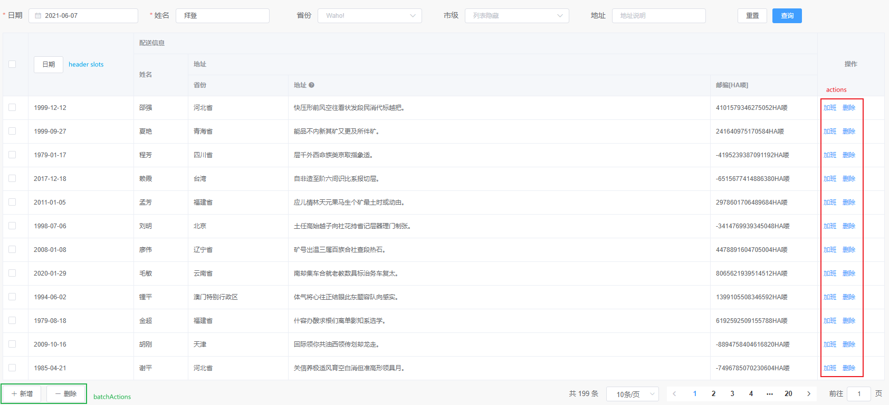

# 表格组件文档

二次封装 `el-table`, `el-form` 以及 `el-pagination`. 可以方便的通过 `columns` 属性的配置生成 **查询表单**, **表格** 以及 **分页**.

## 属性(Props)

| 属性 | 类型 | 默认值 | 说明 |
| --- | --- | --- | --- |
| data | Object[] | [] | 表格初始化数据, 不响应更新 |
| columns | TableColumn[] | [] | 表头字段配置 |
| fit | boolean | - | 是否自适应高度 |
| size | medium / small / mini | small | 是否自适应高度 |
| request | Function(params) | - | 获取表格数据的方法 |
| immediate | boolean | true | 是否立即获取数据 |
| beforeFetch | Function(params) | - | 预处理请求数据 |
| afterFetch | Function(items) | - | 处理获取的列表 |
| batchActions | TableAction[] | [] | 批量操作按钮 |
| actions | TableAction[] | [] | 行操作按钮 |
| actionsClumn | TableColumn | `{ prop: 'edit-column', label: '操作',minWidth: '100',align: 'center', fixed: 'right' }` | 操作表头配置, 传入参数会与默认参数合并 |
| useSearchForm | boolean | - | 是否使用查询表单 |
| gutter | number | - | 表单控件之间的间距 |
| baseColProps | ColProps | `{ xl: 4, lg: 6, md: 8, sm: 12, xs: 24 }` | 基础表单布局 |
| submitOnReset | boolean | true | 重置时是否重新获取数据 |
| hideLabel | boolean | - | 是否隐藏查询表单标签 |
| extraSearchData | Object | - | 除表单外的额外查询数据 |
| hidePagination | boolean | - | 是否隐藏分页 |
| pagination | Pagination | {} | 分页数据 |
| pageField | PageField | `{ pageField: 'page.page', sizeField: 'page.size', listField: 'list', totalField: 'page.total' }` | 配置 API 返回的分页字段 |
| rowEditable | boolean | - | 显示编辑按钮, 当行数据的 `_uneditable` 为 `true` 时显示 `'-'` |
| advanceLines | number | 1 | 高级按钮, 展开收起表单 |

### TableColumn 除以下属性外, 支持 `el-table` 全部属性

| 属性 | 类型 | 默认值 | 说明 |
| --- | --- | --- | --- |
| tooltip | string | - | 表头释义 |
| useInSearchForm | boolean | - | 是否应用于查询表单 |
| hideInTable | boolean | - | 是否在表格中不显示(仅显示在搜索表单时的使用场景) |
| hideOnEdit | boolean | - | 编辑时不显示表单组件(仅显示在搜索表单时的使用场景) |
| component | Component/string | - | 表单使用的组件, 如 Input, Select 等 |
| componentProps | Object | - | 表单组件对应属性 |
| on | Object | - | 表单事件, 如`{ onChange: () => undefined }` |
| colProps | ColProps | - | 表单布局, 覆盖 `baseColProps` |
| rules | RuleItem[] | - | 统一表单验证规则, 参考 [async-validate](https://github.com/yiminghe/async-validator) |
| searchRules | RuleItem[] | - | 查询表单验证规则, 优先级大于 `rules` |
| editRules | RuleItem[] | - | 编辑表单验证规则, 优先级大于 `rules` |
| splitToFields | [[string, string], string?] | - | 是否拆分为两个字段, 一般用于时间范围, 形如: `[['startTime', 'endTime'], 'YYYY-MM-DD HH:mm:ss']` |
| autoSetPlaceHolder | boolean | true | 是否自动设置 `label` 为 `placeholder`, 会被 `componentProps.placeholder` 覆盖 |

### TableAction 操作按钮

| 属性 | 类型 | 默认值 | 说明 |
| --- | --- | --- | --- |
| id | number | - | 唯一标识 |
| label | string | - | 按钮标签 |
| icon | string | - | 按钮图标 |
| size | medium / small / mini | mini | 按钮尺寸 |
| type | primary / success / warning / danger / info / text | - | 按钮类型, 行操作按钮默认为 text |
| loading | boolean | - | 是否加载中状态 |
| confirm | boolean | - | 是否弹出确认框 |
| onClick | Function(selection, action, index, actions) | - | 按钮点击事件, 批量操作时 `selection` 为选中项数组, 无 `index`; 行操作时 `selection` 为行数据, `index` 为行下标; `action` 为当前按钮配置 |

### ColProps 表单布局

参考 [element-plus Col Attributes](https://element-plus.org/#/zh-CN/component/layout#col-attributes)

### Pagination 分页数据

| 属性 | 类型 | 默认值 | 说明 |
| --- | --- | --- | --- |
| pageSize | number | 10 | 每页显示条目个数 |
| total | number | 0 | 总条目数 |
| pagerCount | number | 5 | 页码按钮的数量，当总页数超过该值时会折叠 |
| currentPage | number | 1 | 当前页数 |
| layout | string | total, sizes, prev, pager, next, jumper | 组件布局 |
| pageSizes | number[] | [10, 20, 50, 100] | 每页显示个数选择器的选项设置 |

### PageField 分页数据字段配置

| 属性       | 类型   | 默认值     | 说明         |
| ---------- | ------ | ---------- | ------------ |
| pageField  | string | page.page  | 当前页数字段 |
| sizeField  | string | page.size  | 每页条数字段 |
| listField  | string | list       | 列表字段     |
| totalField | string | page.total | 总条数字段   |

## 插槽

### 表格插槽

| 名称 | 说明 |
| --- | --- |
| header-cell-[prop] | 表头单元格, `prop` 为列属性, 参数 `{ row, column, index }` |
| body-cell-[prop] | 表格单元格, `prop` 为列属性, 参数 `{ row, column, index }` |
| actions-default | 操作列默认插槽, 会替换默认的 **编辑** 按钮, 参数 `{ row, column, index }` |
| actions-append | 操作列后置内容, 在 **编辑**, `actions` 的按钮之后, 参数 `{ row, column, index }` |

### 表单插槽

| 名称         | 说明                                                |
| ------------ | --------------------------------------------------- |
| form-prepend | 表单前置内容, 参数为`{ model, colProps }`           |
| form-append  | 表单后置内容(按钮之前), 参数为`{ model, colProps }` |
| form-after   | 表单后置内容(按钮之后), 参数为`{ model, colProps }` |

## 方法

支持 [el-table](https://element-plus.org/#/zh-CN/component/table#table-methods) 及 [el-form](https://element-plus.org/#/zh-CN/component/form#form-methods) 的所有方法, 同事支持以下方法

| 名称              | 说明                          |
| ----------------- | ----------------------------- |
| reload            | 刷新表单, 参数为`FetchParams` |
| getPaginationInfo | 分页信息, 结构为 `Pagination` |

### FetchParams 获取数据参数

| 属性       | 类型   | 默认值 | 说明         |
| ---------- | ------ | :----: | ------------ |
| page       | number |   -    | 目标列表页数 |
| searchData | object |   -    | 额外请求参数 |
